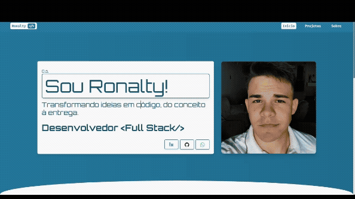

# 📌 Portfólio

Uma aplicação web interativa desenvolvida com React, Tailwind CSS e Framer Motion, exibindo um carrossel de ícones, header responsivo e integração com GitHub Pages.

---

## 🔗 Links

👉 [Acesse a aplicação](https://ronaltyfernandes.github.io/agroBem/)

---

## 📸 Screenshots

<!-- Adicione aqui prints da aplicação -->
<p align="center">
  
</p>

---

## 📦 Tecnologias Utilizadas

-  **React** – Biblioteca principal para construção da interface.
-  **TypeScript** – Tipagem estática para maior segurança e organização do código.
-  **Tailwind CSS** – Framework para estilização rápida e responsiva.
-  **Framer Motion** – Animações suaves e interativas no carrossel e header.
-  **GitHub Pages** – Hospedagem da aplicação diretamente do repositório.

---

## 🚀 Funcionalidades

- Header responsivo com animação ao scroll.
- Modal de navegação para dispositivos móveis.
- Carrossel de ícones com animação contínua e pausa ao hover.
- Links para seções com smooth scroll.
- Layout totalmente responsivo para desktop, tablet, mobile.

---

## 💻 Como Rodar o Projeto Localmente

1. Clone o repositório:

````bash
git clone [https://github.com/ronaltyfernandes/portfolio.git](https://github.com/ronaltyfernandes/portfolio.git)

```bash
npm install
# ou
yarn install

```bash
npm run dev
# ou
yarn run dev
````
